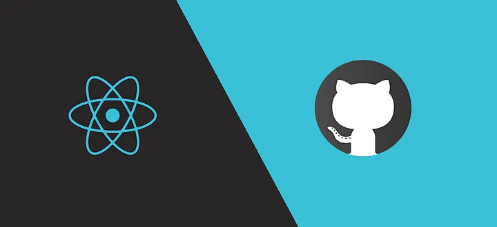
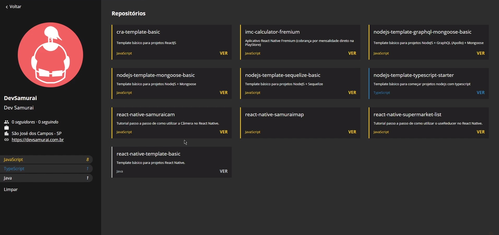

  <!--Adicionar logotipo do projeto aqui-->
  

    
  
 

  <h1>Search Repositories</h1>
  
API Github, um projeto responsivo para buscar usuários e repositórios no site Github 
     Elaborado no curso de programação: DevSamurai (https://devsamurai.com.br)
  

  

    
  
 

  <!--Adicionar imagem/gif do projeto aqui-->
  

    
  

## 🚀 Iniciar

⚙ Baixar e Instalar Node.js

- [Node.js](https://nodejs.org/en)

##

🡇 Comando no terminal para clonar o repositório

    git clone https://github.com/Doug-Silva/search-repositories.git

##

🡇 Comando no terminal para executar o projeto

    npm start

##

💻 Desenvolva o projeto na sua IDE de preferência

- [Visual Studio Code](https://code.visualstudio.com/download)
- [WebStorm](https://www.jetbrains.com/webstorm)

## 🔨 Seja um dos contribuidores 

Quer fazer parte desse projeto? Clique [AQUI](CONTRIBUTING.md) e leia como contribuir.

<a href='#voltar-topo'>⬆ Voltar ao topo</a> 
